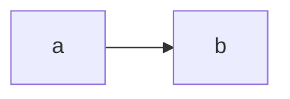

A mermaid diagram, which should still draw:


```mermaid
flowchart LR
  a --> b
```

An OJS cell, which the probe should host:

```{ojs2}
display(1 + 1);
```

A plain code block:

```python
print("untouched")
```
